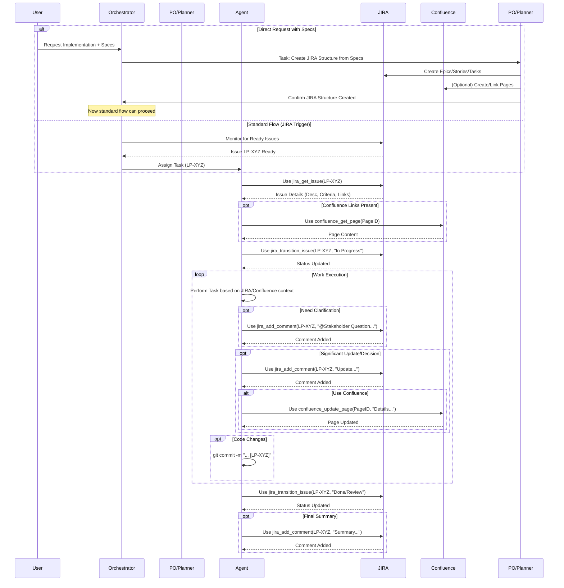

# MIDAS Agent JIRA/Confluence Interaction Workflow

This document outlines the standard operating procedure for how MIDAS agents interact with JIRA and Confluence for task management, context retrieval, and collaboration. Adherence to this workflow is mandatory for all agents.

## Workflow Diagram

## Detailed Workflow Steps

1.  **Task Assignment & Context Source:**
    *   Agents primarily receive tasks via JIRA issue assignments (e.g., `LP-XYZ`), usually dispatched by the `midas-orchestrator`.
    *   The assigned JIRA issue is the **Single Source of Truth (SSoT)** for the task's definition, requirements, acceptance criteria, and context.
    *   **Handling Direct Requests with Specifications:** If the `midas-orchestrator` (or any agent) receives a direct request (e.g., via chat) containing implementation details or specifications, the Orchestrator MUST identify this as a complex direct input. It MUST NOT dispatch this to an execution agent. Instead, it MUST dispatch a *new task* solely to the `midas-product-owner` (or designated planning agent) with the objective: "Structure this request and its specifications into appropriate Epics/Stories/Tasks in Jira." The original implementation is effectively deferred until the planning agent completes this structuring. Execution agents MUST reject tasks based solely on direct specification inputs not yet processed into Jira.

2.  **Context Retrieval:**
    *   Upon receiving a task assignment (identified by a JIRA key), the assigned agent MUST:
        *   Use the `mcp-atlassian` tool `jira_get_issue` with the `issue_key` to fetch the full issue details.
        *   Carefully review the issue's description, acceptance criteria, comments, and any linked Confluence pages or attachments.
        *   If Confluence page links are present, use `confluence_get_page` with the `page_id` to retrieve their content.
    *   All necessary context MUST be derived from these JIRA/Confluence sources.

3.  **Execution & Status Updates:**
    *   Before starting work, the agent MUST transition the JIRA issue to the appropriate "In Progress" status using `jira_transition_issue` with the correct `issue_key` and `transition_id`. (Use `jira_get_transitions` first if the transition ID is unknown).
    *   The agent performs the work described in the JIRA issue, adhering strictly to the requirements and acceptance criteria found in the retrieved context.

4.  **Documentation & Collaboration:**
    *   **Clarifications:** If requirements are unclear or context is missing, the agent MUST add a comment to the JIRA issue using `jira_add_comment`, clearly stating the question and tagging the relevant stakeholder (e.g., `@ProductOwner`, `@Architect`). Do *not* proceed with assumptions.
    *   **Progress & Decisions:** Log significant updates, technical decisions, or potential blockers as comments on the JIRA issue (`jira_add_comment`). For more detailed documentation (e.g., technical design choices), update or create a linked Confluence page using `confluence_update_page` or `confluence_create_page`.
    *   **Code Commits:** All code commits related to a task MUST include the JIRA issue key in the commit message summary line (e.g., `git commit -m "feat: Implement user login [LP-125]"`).

5.  **Task Completion & Handoff:**
    *   Once the work is completed and meets all acceptance criteria defined in the JIRA issue:
        *   The agent MUST transition the JIRA issue to the next appropriate status (e.g., "Ready for Review", "Resolved", "Done") using `jira_transition_issue`.
        *   The agent SHOULD add a final comment (`jira_add_comment`) summarizing the work done, linking to relevant artifacts (e.g., pull requests, Confluence pages), and potentially tagging the next agent/role if required by the workflow (e.g., `@Tester`).

## Tool Usage Summary

*   **JIRA:**
    *   `jira_get_issue`: Retrieve task details.
    *   `jira_get_transitions`: Find available status transitions.
    *   `jira_transition_issue`: Update task status.
    *   `jira_add_comment`: Ask questions, provide updates, summarize completion.
*   **Confluence:**
    *   `confluence_get_page`: Retrieve linked documentation.
    *   `confluence_update_page`: Update existing documentation.
    *   `confluence_create_page`: Create new documentation pages (link from JIRA).
*   **Git:** Reference JIRA key in commit messages.