# MIDAS 🚀 Memory-Integrated Development and Architecture System

**_An agentic AI framework for structured software development within RooCode, leveraging specialized agents and deep GitHub integration._**

---

## Table of Contents

-   [Introduction](#introduction)
-   [Core Concepts & Features](#core-concepts--features)
-   [Architecture Overview](#architecture-overview)
-   [Installation](#installation)
    -   [Prerequisites](#prerequisites)
    -   [One-Liner Install Script](#one-liner-install-script)
    -   [Manual Setup Steps (Required)](#manual-setup-steps-required)
-   [Usage](#usage)
    -   [Initiating a Workflow](#initiating-a-workflow)
    -   [Monitoring Progress](#monitoring-progress)
    -   [Agent Interaction](#agent-interaction)
-   [Configuration](#configuration)
-   [MIDAS Agent Roles](#midas-agent-roles)
-   [Code-Based Components (Conceptual)](#code-based-components-conceptual)
-   [Contributing](#contributing)
-   [License](#license)

---

## Introduction

Project MIDAS is an advanced agentic AI framework designed to automate and orchestrate complex software development workflows directly within the **RooCode** development environment. It addresses the challenges of managing medium-to-large projects by employing a team of specialized AI agents that collaborate to handle tasks ranging from high-level planning and architecture to coding, testing, security analysis, and deployment preparation.

MIDAS leverages deep integration with **GitHub Issues** and **GitHub Projects v2** for hierarchical task management and utilizes **Markdown files within the repository** for documentation (ADRs, technical designs, etc.). Communication and workflow progression are managed internally through agent interactions facilitated by the GitHub API (via MCP) and RooCode's task execution capabilities.

**Key Goals:**

-   **Structured Automation:** Bring predictable, structured automation to the software development lifecycle.
-   **GitHub Native:** Treat GitHub as the central hub for task management and documentation.
-   **Agent Collaboration:** Enable effective collaboration between specialized AI agents.
-   **Robustness & Cost-Efficiency:** Implement mechanisms (initially via agent instructions, ideally evolving to code components) to improve reliability and manage LLM token usage.
-   **RooCode Synergy:** Operate seamlessly within the RooCode environment.

## Core Concepts & Features

-   **Specialized Agent Roles:** Distinct agents (Planner, PO, Architect, Coder, Tester, etc.) handle specific tasks, allowing for tailored instructions and potentially higher quality outputs.
-   **GitHub-Centric Workflow:** Uses GitHub Issues (mapped to Features, Epics, Stories, Tasks, Bugs, Vulnerabilities) and aims for Projects v2 integration for hierarchy. Documentation resides within the Git repository.
-   **Internal Orchestration:** A dedicated `MIDAS Orchestrator Agent` monitors GitHub state via the GitHub MCP server and dispatches tasks to other agents using RooCode's `new_task`. Workflow progression relies on agents updating GitHub issue labels.
-   **Asynchronous Communication:** Agents use GitHub Issue comments (`@mentioning` roles) for requests and responses within a workflow phase (e.g., code reviews, clarifications).
-   **MCP for Tooling:** Relies on external MCP servers (configured in RooCode) for standardized access to Filesystem, Git, and GitHub APIs.
-   **RooCode Integration:** Natively runs within RooCode, leveraging its UI, LLM access, file/terminal operations, and MCP client.
-   **Configurable & Extensible:** Designed to be adaptable through configuration files and potentially custom agent definitions.
-   **Template-Driven Consistency:** Uses templates (`.roo/templates/`) for creating GitHub issues and documentation, ensuring standardization.

## Architecture Overview

MIDAS operates as a system of agents and rules within the RooCode environment. It does *not* require a separate external monitoring service; orchestration is managed internally.

```mermaid

graph TD
    subgraph RooCode Environment
        User --> RooCodeInterface[RooCode UI/Commands]
        RooCodeInterface --> MIDASCore[MIDAS Agents via new_task]

        subgraph "MIDAS Core Logic (Agents & Rules)"
            direction LR
            OrchestratorAgent[MIDAS Orchestrator Agent] -.-> AgentPool
            OrchestratorAgent -- Polls --> RooCodeMCP[RooCode MCP Client]
            OrchestratorAgent -- Triggers --> MIDASCore

            AgentPool -- Contains --> PlannerAgent[Planner]
            AgentPool -- Contains --> POAgent[Product Owner]
            AgentPool -- Contains --> ArchitectAgent[Architect]
            AgentPool -- Contains --> CoderAgent[Coder]
            AgentPool -- Contains --> TesterAgent[Tester]
            AgentPool -- Contains --> DevOpsAgent[DevOps]
            AgentPool -- Contains --> SecurityAgent[Security]
            AgentPool -- Contains --> UIAgent[UI/UX]

            PlannerAgent -- Uses --> RooCodeMCP
            POAgent -- Uses --> RooCodeMCP
            CoderAgent -- Uses --> RooCodeMCP
            CoderAgent -- Uses --> RooCodeFS[RooCode File System Access]
            CoderAgent -- Uses --> RooCodeTerminal[RooCode Terminal Access]
            ArchitectAgent -- Uses --> RooCodeMCP
            ArchitectAgent -- Uses --> RooCodeFS
            TesterAgent -- Uses --> RooCodeMCP
            TesterAgent -- Uses --> RooCodeTerminal
            DevOpsAgent -- Uses --> RooCodeMCP
            DevOpsAgent -- Uses --> RooCodeTerminal
            SecurityAgent -- Uses --> RooCodeMCP
            SecurityAgent -- Uses --> RooCodeTerminal
            UIAgent -- Uses --> RooCodeMCP

            %% Code-based component interaction (Conceptual)
            CoderAgent -.-> ContextOptimizerSVC[ContextOptimizer Service]
            ArchitectAgent -.-> RobustnessCheckerSVC[RobustnessChecker Service]

        end

        MIDASCore --> ModelInteraction[LLM Interaction via RooCode]
        MIDASCore --> RooCodeFS
        MIDASCore --> RooCodeTerminal
        MIDASCore --> RooCodeMCP

        RooCodeMCP --> MCPServers["External MCP Servers (Filesystem, Git, github)"]
    end

    ModelInteraction --> ExternalLLMs[LLMs]

    %% style MIDAS Core Logic (Agents & Rules) fill:#fdf,stroke:#f8f,stroke-width:1px
    style RooCodeEnvironment fill:#ccf,stroke:#66f,stroke-width:2px
```



-   **User Interaction:** Managed via RooCode's UI/Commands.
-   **Orchestration:** The `MIDAS Orchestrator Agent` periodically checks GitHub (via MCP) for issues whose labels indicate they are ready for the next step. It then uses RooCode's `new_task` to activate the appropriate agent.
-   **Agent Execution:** Specialized agents perform their tasks, using RooCode's capabilities to interact with LLMs, the filesystem, the terminal, and external tools via configured MCP servers.
-   **State Transitions:** Agents update GitHub issue labels via the GitHub MCP upon starting and completing tasks, signaling the Orchestrator Agent about workflow progression.

## Installation

### Prerequisites

-   **RooCode:** The MIDAS framework runs *inside* RooCode. Ensure RooCode is installed and operational.
-   **Command-Line Tools:**
    -   Essential: `git`, `curl`, `unzip`
    -   Optional (for faster downloads): `svn`
-   **External Tooling (Potentially Required):** Depending on agent tasks, ensure tools like `node`, `python`, `docker`, `terraform`, `mmdc` (Mermaid CLI), specific linters, test runners, or security scanners are available in the environment where RooCode executes commands. Check agent definitions (`.roo/agents/*.agent.md`) for hints.

### One-Liner Install Script

Run this command from the **root directory** of your target project:

```bash
sh install.sh
```

### Manual Setup Steps (Required)

The script automates file downloads, but you **must** perform these steps manually:

1.  **Setup External MCP Servers:**
    *   MIDAS relies on external MCP servers for **Filesystem**, **Git**, and **GitHub** access.
    *   Obtain or build these servers (e.g., from reference implementations like those provided by Anthropic or the community).
    *   Run these servers locally (often via Docker).
    *   **Crucially for GitHub:** Generate a GitHub Personal Access Token (PAT) with sufficient permissions (`repo`, `project`, `read:org`) and configure the GitHub MCP server to use it securely.
2.  **Configure RooCode:**
    *   In your RooCode configuration, add connections to the running MCP servers you set up in the previous step. Ensure the host/port details are correct.
3.  **Install Agent CLI Dependencies:**
    *   Review the `.roo/agents/*.agent.md` files. If agents use `execute_command` for specific tools (build tools, test runners, IaC tools, diagramming tools like `mmdc`, security scanners), ensure these tools are installed and accessible within the RooCode execution environment.
4.  **(Optional) RooCode Common Rules Processing:**
    *   The framework includes `.roo/agents/_common_rules.md`. For this to work effectively, your RooCode environment needs to support prepending this common file's content to individual agent definitions before processing them. Check your RooCode version/features or request this capability if needed.

## Usage

### Initiating a Workflow

Typically, you initiate a MIDAS workflow via a RooCode command, often targeting the `MIDAS Strategic Planner` agent with an initial specification or goal.

```
# Example (Conceptual RooCode Command)
/roo midas/strategic_planner/initiate_planning spec="Build a user login system with email/password and Google OAuth." repo="your-org/your-repo" docs_path="docs/project-alpha"
```

### Monitoring Progress

-   **GitHub Issues:** The primary way to track progress is by monitoring the status labels and comments on the GitHub Issues created and managed by MIDAS agents.
-   **RooCode UI:** RooCode should display the logs and outputs of the currently running agent task.
-   **Documentation:** Check the documentation files created/updated within the repository (e.g., in the `docs/` path you configured).

### Agent Interaction

-   **Handoffs:** Workflow progression between major roles (Planner -> PO -> Coder -> Tester -> DevOps) happens automatically based on agents updating `status:*` labels on GitHub Issues. The `MIDAS Orchestrator Agent` detects these changes (via polling the GitHub MCP) and triggers the next agent via `new_task`.
-   **Asynchronous Requests:** For non-handoff communication (e.g., requesting a review, asking for clarification), agents will post comments on the relevant GitHub Issue, typically `@mentioning` the target agent role (e.g., `@midas-architect Please review...`). The requesting agent might pause or the responding agent will pick up the request when it next processes that issue.

## Configuration

MIDAS behavior can be tailored via configuration (likely managed through RooCode settings or dedicated project configuration files, e.g., `.roo/midas_config.yaml` - *exact mechanism depends on RooCode*):

-   **LLM Providers & Models:** API keys, endpoints, default models, model selection per agent role.
-   **Prompts:** Paths to custom templates or overrides for system prompts.
-   **GitHub Details:** Target repository owner/name, project number/ID, standard label names, custom field mappings.
-   **MCP Server Connections:** URLs/ports for configured MCP servers.
-   **Documentation Strategy:** Default `docs_strategy` (e.g., 'Hugo', 'Markdown') and `docs_path`.
-   **Robustness Parameters:** (If implemented as configurable) Retry counts, timeouts, loop detection thresholds.

## MIDAS Agent Roles

-   **`MIDAS Orchestrator Agent`:** Monitors GitHub (via MCP) for ready tasks and dispatches them to other agents. *Runs internally.*
-   **`MIDAS Strategic Planner`:** Analyzes specifications, defines Epics (GitHub Issues), initiates documentation structure, requests high-level Arch review, hands off to PO.
-   **`MIDAS Product Owner`:** Decomposes Epics into Stories/Tasks (GitHub Issues), defines acceptance criteria, manages dependencies, requests Arch/UX reviews, hands off Tasks to Coder.
-   **`MIDAS Architect`:** Responds to review requests (via comments), creates/maintains ADRs and TDDs (in repo docs), provides design overviews, ensures technical feasibility.
-   **`MIDAS Coder`:** Implements Tasks/Bugs (via PRs), writes unit tests, requests Arch/UX reviews, potentially writes How-To guides, hands off to Tester.
-   **`MIDAS Tester`:** Executes tests against PRs/branches, reports Bugs (GitHub Issues), verifies fixes, updates status, requests DevOps support (e.g., environment URLs).
-   **`MIDAS Security Specialist`:** Performs security scans/reviews upon request, reports Vulnerabilities (GitHub Issues).
-   **`MIDAS DevOps Engineer`:** Manages CI/CD, infrastructure (IaC), deployments, provides environment details upon request, updates deployment status.
-   **`MIDAS UI/UX Designer`:** Responds to design/review requests, provides UI specifications/mockup links (via comments), ensures usability and consistency.


## Contributing

TODO

## License

TODO