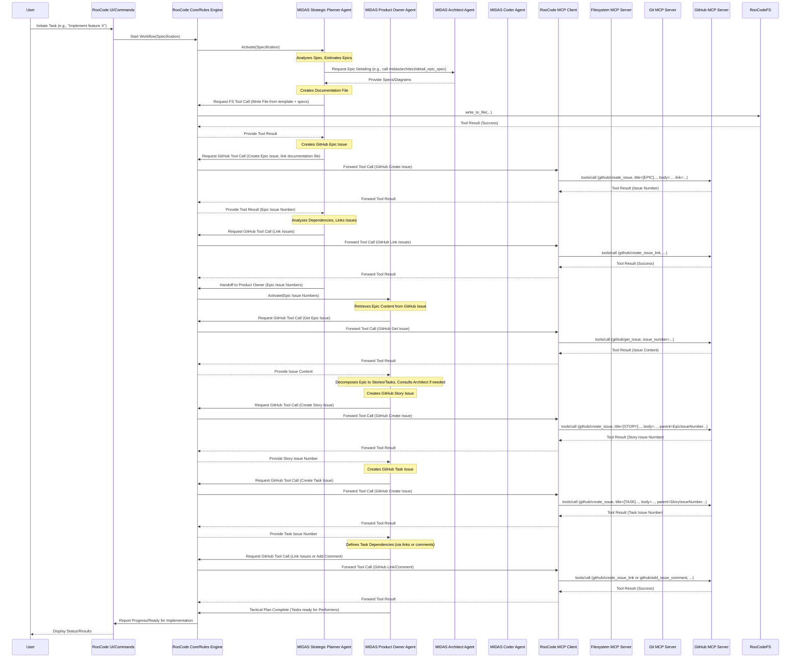

# Project MIDAS: Final Plan

## 1. Introduction & Goals

**Primary Goal:** To establish an agentic AI framework (MIDAS) running *within* the RooCode environment that enables efficient, reliable automation of software development tasks (including coding, architecture, debugging, UI/UX), optimizing for cost and robustness, while seamlessly integrating with **GitHub Issues** for task management and **file-based documentation within the repository**.

**Key Emphasis:** Facilitate effective **communication and collaboration between specialized agents** to accomplish complex development workflows.

## 2. Guiding Principles

*   **Cost Efficiency:** Prioritize minimizing LLM token consumption through intelligent context management, strategic model selection, and optimized workflows.
*   **Robustness:** Build in mechanisms to proactively detect and mitigate common failure modes like infinite loops, hallucinations, and execution errors, ensuring predictable and reliable operation.
*   **Deep Integration:** Ensure first-class, seamless integration with the host RooCode environment and GitHub.
*   **Specialization & Collaboration:** Employ a diverse pool of specialized agents and enable effective inter-agent communication and task handoffs.
*   **Customizability & Extensibility:** Design for flexibility, allowing projects to tailor agents, tools, prompts, and workflows.
*   **Standardization:** Leverage RooCode's built-in capabilities (MCP client, file access, LLM interaction) and standard APIs (GitHub REST).

## 3. Revised Core Architecture (Running within RooCode)

MIDAS runs within the RooCode environment, leveraging its existing infrastructure for UI, LLM access, file system operations, terminal execution, and MCP client functionality to interact with external MCP servers like `github`. Core MIDAS logic (Orchestration, Token Management, Robustness) will initially be implemented via agent definitions and RooCode rules.

```mermaid
graph TD
    subgraph RooCode Environment
        User --> RooCodeInterface[RooCode UI/Commands]
        RooCodeInterface --> MIDASCore[MIDAS Agents & Rules Engine]
        MIDASCore --> RooCodeMCP[RooCode MCP Client]
        MIDASCore --> RooCodeFS[RooCode File System Access]
        MIDASCore --> RooCodeTerminal[RooCode Terminal Access]
        RooCodeMCP --> MCPServers[External MCP Servers (Filesystem, Git, github)]
    end

    subgraph MIDAS Components (Implemented via Agents/Rules)
        direction LR
        SpecIntake[Specification Intake Agent] --> PlannerAgent[MIDAS Planner Agent]
        PlannerAgent --> ArchitectAgent[MIDAS Architect Agent]
        PlannerAgent --> ProductOwnerAgent[MIDAS Product Owner Agent]
        ProductOwnerAgent --> ArchitectAgent
        ProductOwnerAgent --> PerformerAgent[MIDAS Performer Agents (Coder, Tester...)]
        PlannerAgent --> RooCodeMCP
        ProductOwnerAgent --> RooCodeMCP
        PerformerAgent --> RooCodeMCP
        PerformerAgent --> RooCodeFS
        PerformerAgent --> RooCodeTerminal
        ArchitectAgent --> RooCodeMCP
        ArchitectAgent --> RooCodeFS
        %% Core logic like Token Management, Robustness, Orchestration is embedded in agent instructions/rules initially
    end


    ModelInteraction[LLM Interaction via RooCode] --> ExternalLLMs[LLMs]
    MIDASCore --> ModelInteraction


    style MIDASCore fill:#f9f,stroke:#333,stroke-width:2px
    style RooCodeEnvironment fill:#ccf,stroke:#66f,stroke-width:2px
```

## 4. Component Responsibilities

*   **RooCode Interface:** Handles user interaction, command parsing, and displaying MIDAS output within the RooCode environment.
*   **MIDAS Agents & Rules Engine:** The core logic implemented through specialized agent definitions (`.roo/agents/*.md`) and RooCode's internal rule/orchestration capabilities.
    *   **Agent Pool:** Defined roles include `MIDAS Strategic Planner`, `MIDAS Product Owner`, `MIDAS Architect`, `MIDAS Coder` (incl. Debugger), `MIDAS Tester`, `MIDAS Security Specialist`, `MIDAS DevOps Engineer`, `MIDAS UI/UX Designer`. Each agent definition (`.roo/agents/*.agent.md`) contains specific instructions, tool usage protocols, collaboration points, and defined interfaces.
    *   **Orchestration:** Managed via agent instructions and RooCode's execution flow. Agents trigger subsequent agents or actions based on their defined process and outputs. Inter-agent communication relies on passing structured data or invoking specific tools defined by collaborating agents (e.g., Planner calling Architect).
    *   **Token Management:** Strategies (Summarization, RAG, Budgeting, Reactive Handoffs/Decomposition) are embedded within agent instructions and potentially enforced by RooCode's core LLM interaction layer.
    *   **Robustness:** Mechanisms (Loop Detection hints, Hallucination Mitigation prompts, Error Handling instructions, HITL triggers) are defined within agent instructions, relying on agent compliance and RooCode's capabilities.
*   **RooCode Capabilities:** MIDAS leverages RooCode's native UI, LLM interaction, file system access, terminal execution, and MCP client to interact with external tools.

## 5. GitHub Integration Strategy

*   **Hierarchy:** Specification -> GitHub Epic Issue -> GitHub Story Issue -> GitHub Task Issue.
*   **Tooling:** Agents utilize tools provided by the external `github` MCP server (configured in RooCode) for all GitHub Issue interactions (creation, updates, linking, searching, commenting) and file system tools for documentation.
*   **Documentation:**
    *   The `MIDAS Planner` collaborates with the `MIDAS Architect` to generate detailed specifications for Epics and Architectural Decision Records (ADRs).
    *   These documents are created as Markdown files within the repository (e.g., in a `docs/` or `docs/architecture/` directory) using predefined templates from `.roo/templates/github/`.
    *   Documentation files are linked from their corresponding GitHub Issues where relevant.
*   **Authentication:** Handled by RooCode's MCP client configuration for the `github` server.

## 6. Context Token Management Strategy (Detailed)

Managed jointly by the Token Manager, Orchestrator, and Robustness Engine:

*   **Proactive (Token Manager):**
    *   **Dynamic Summarization:** Auto-summarize less critical context before limits are hit.
    *   **RAG:** Prioritize retrieving relevant context snippets over full history/files.
    *   **Context Budgeting:** Allocate tokens and prune lowest priority context first.
*   **Reactive (Orchestrator & Robustness Engine):**
    *   **Graceful Truncation/Prioritization:** Drop least critical info first if truncation is unavoidable.
    *   **Automated Task Decomposition:** Break down context-heavy tasks into smaller sub-tasks.
    *   **Stateful Context Handoff:** Save essential state/summary and restart agent operation in a new context window when limits are strictly hit.
    *   **HITL Trigger:** Prompt user for guidance when critical context loss is imminent.

## 7. Inter-Agent Communication

Inter-agent communication is managed via defined interfaces (hypothetical tools/commands) exposed by each agent and invoked by others through RooCode's orchestration/rules engine.

**Defined Agent Interfaces (Illustrative):**

*   **`MIDAS Strategic Planner`**
    *   *Exposes:*
        *   `midas/strategic_planner/initiate_planning(specification: str)`: Starts the planning workflow.
        *   `midas/strategic_planner/handle_major_change(change_request: str, impacted_epics: List[str])`: Handles strategic adjustments.
    *   *Consumes:*
        *   `midas/architect/detail_epic_spec`: To get technical details for Epics.
        *   `midas/product_owner/decompose_epics` (or similar trigger): To hand off defined Epics.
        *   `github` tools (create_issue, list_issues).

*   **`MIDAS Product Owner`**
    *   *Exposes:*
        *   `midas/product_owner/decompose_epics(epic_keys: List[str], documentation_urls: List[str])`: Starts tactical breakdown for given Epics. documentation light be Hugo, Mkdocs, ....
        *   `midas/product_owner/refine_story(story_key: str, feedback: str)`: Updates a Story based on feedback.
        *   `midas/product_owner/get_ready_tasks()`: Lists tasks ready for implementation.
        *   `midas/product_owner/handoff_to_performer(task_key, performer_role)`: Assigns task to Coder/Tester etc.
        *   `midas/product_owner/get_story_details(story_key)`: Provides Story context.
    *   *Consumes:*
        *   `midas/architect/review_tasks_for_story`: For technical validation.
        *   `midas/ui_ux/get_design_requirements`: For UI/UX input.
        *   `github` tools (get_issue, create_issue, update_issue, create_issue_link, add_issue_comment).
        *   RooCode FS tools (read_file for templates).

*   **`MIDAS Architect`**
    *   *Exposes:*
        *   `midas/architect/detail_epic_spec(epic_context: str)`: Provides technical specs/diagrams for an Epic.
        *   `midas/architect/review_tasks_for_story(story_context: str, task_list: List[Dict])`: Validates technical tasks.
        *   `midas/architect/create_adr(decision_context: Dict)`: Creates ADR file in the repository.
        *   `midas/architect/get_design_overview(component_or_feature: str)`: Provides architectural summary.
    *   *Consumes:*
        *   `midas/devops/get_infra_constraints`: For infrastructure context.
        *   `github` tools (get_issue, add_issue_comment).
        *   RooCode FS/Git MCP/Terminal tools (for code analysis, diagram generation, reading/writing documentation files).

*   **`MIDAS Coder`** (incl. Debugger)
    *   *Exposes:*
        *   `midas/coder/implement_task(task_key: str)`: Starts coding a task.
        *   `midas/coder/debug_and_fix(bug_key: str)`: Starts debugging a bug.
        *   `midas/coder/report_status(task_key: str, status_details: str, commit_hash: str)`: Reports progress.
        *   `midas/coder/request_ui_review(task_key: str, preview_url_or_branch: str)`: Asks UI/UX for review.
    *   *Consumes:*
        *   `midas/architect/clarify_design`: For design questions.
        *   `midas/tester/get_reproduction_steps`: For bug details.
        *   `midas/ui_ux/get_ui_specs`: For detailed UI guides.
        *   `github` tools (get_issue, update_issue, add_issue_comment).
        *   RooCode FS/Git MCP/Terminal tools (coding, testing, debugging).

*   **`MIDAS Tester`**
    *   *Exposes:*
        *   `midas/tester/test_item(item_key: str, item_type: str)`: Starts testing a Task or Story.
        *   `midas/tester/report_results(item_key: str, test_summary: str, bug_keys: List[str])`: Provides test outcome.
        *   `midas/tester/get_reproduction_steps(bug_key: str)`: Provides bug details.
    *   *Consumes:*
        *   `midas/devops/get_environment_url`: To get deployment endpoint.
        *   `github` tools (get_issue, update_issue, add_issue_comment, create_issue).
        *   RooCode FS/Git MCP/Terminal tools (accessing tests, running suites).

*   **`MIDAS Security Specialist`**
    *   *Exposes:*
        *   `midas/security/perform_security_scan(scope: str, scan_type: str)`: Initiates a scan.
        *   `midas/security/review_code_for_security(code_path_or_commit: str)`: Performs code review.
        *   `midas/security/report_security_findings(item_key: str, findings_summary: str, vulnerability_keys: List[str])`: Delivers results.
    *   *Consumes:*
        *   `midas/architect/get_design_overview`: To understand context.
        *   `midas/devops/get_pipeline_config`: To review CI/CD security.
        *   `github` tools (get_issue, create_issue, add_issue_comment).
        *   RooCode FS/Git MCP/Terminal tools (code access, running scanners).

*   **`MIDAS DevOps Engineer`**
    *   *Exposes:*
        *   `midas/devops/setup_pipeline(repository_url: str, config_details: Dict)`: Configures CI/CD.
        *   `midas/devops/deploy_release(environment: str, version_tag_or_commit: str)`: Executes deployment.
        *   `midas/devops/manage_infrastructure(action: str, config_file: str)`: Applies IaC changes.
        *   `midas/devops/report_deployment_status(environment: str, status: str, details: str)`: Reports outcome.
        *   `midas/devops/get_environment_url(environment_name: str)`: Provides endpoint URL.
        *   `midas/devops/get_pipeline_config()`: Provides pipeline details.
    *   *Consumes:*
        *   `midas/architect/get_infrastructure_requirements`: For infra needs.
        *   `midas/tester/get_test_results`: To check tests before deploy.
        *   `midas/security/get_scan_results`: To check scans before deploy.
        *   `github` tools (get_issue, update_issue, add_issue_comment).
        *   RooCode FS/Git MCP/Terminal tools (IaC, CI/CD CLIs, scripting).

*   **`MIDAS UI/UX Designer`**
    *   *Exposes:*
        *   `midas/ui_ux/design_ui_for_item(item_key: str)`: Starts design work.
        *   `midas/ui_ux/provide_design_artifacts(item_key: str, spec_details: str, asset_links: List[str])`: Delivers designs.
        *   `midas/ui_ux/review_ui_implementation(task_key: str, implementation_details: str)`: Provides feedback.
        *   `midas/ui_ux/get_design_requirements(item_key: str)`: Provides UI needs context.
        *   `midas/ui_ux/get_ui_specs(task_key: str)`: Provides detailed UI specs.
    *   *Consumes:*
        *   `midas/product_owner/get_story_details`: For requirements.
        *   `midas/coder/request_ui_review`: Trigger for review.
        *   `github` tools (get_issue, add_issue_comment).
        *   RooCode FS/Terminal tools (viewing code/running dev server, accessing design files).

## 8. Setup Automation Script

*   **Purpose:** Simplify initial environment setup for MIDAS within RooCode.
*   **Tasks:**
    1.  Provide commands/instructions (e.g., Docker) to run required *external* MCP servers: Filesystem, Git, and `github`.
    2.  Guide RooCode configuration for connecting to these external MCP servers, including authentication for `github`.
    3.  *(Optional: Script to generate placeholder `.md` templates in `.roo/templates/github/`)*.
    4.  Place MIDAS agent definition files (`.md` format) into the `.roo/agents/` folder structure.

## 9. Detailed Task Breakdown

*   **Phase 1: Design & Foundation (Completed)**
    *   **Task 1.1:** Define GitHub Issue Hierarchy usage within MIDAS (Epic -> Story -> Task). - *Completed*
    *   **Task 1.2:** Define File-based Documentation Strategy (FUAM, Structure, Templates in `.roo/templates/github/`, Linking from Issues). - *Completed*
    *   **Task 1.3:** Define core inter-agent communication protocols (Interfaces listed in Section 7). - *Completed*
    *   **Task 1.4:** Define initial structure and format for MIDAS agent definitions (`.roo/agents/*.agent.md`). - *Completed*
    *   **Task 1.5:** Define initial specialized agent roles, responsibilities, and prompts (Strategic Planner, Product Owner, Architect, Coder, Tester, Security Specialist, DevOps Engineer, UI/UX Designer). - *Completed*
*   **Phase 2: Initial Agent Implementation & Workflow**
    *   **Task 2.1:** Implement `MIDAS Strategic Planner` agent definition (`.roo/agents/strategic_planner.agent.md`) including collaboration steps and `github` tool usage for Epic creation and file-based documentation. - *Completed*
    *   **Task 2.2:** Implement `MIDAS Product Owner` agent definition (`.roo/agents/product_owner.agent.md`) for Story/Task decomposition and `github` tool usage. - *Completed*
    *   **Task 2.3:** Implement `MIDAS Architect` agent definition (`.roo/agents/architect.agent.md`) defining its interface for collaboration (`detail_epic_spec`, `review_tasks_for_story`) and file-based ADR creation. - *Completed*
    *   **Task 2.4:** Implement basic Token Management & Robustness strategies within agent instructions (e.g., context handling hints, error reporting). - *Completed*
    *   **Task 2.5:** Test initial workflow: Specification -> Planner -> Architect -> Planner -> Product Owner -> GitHub Issue and file-based documentation creation.
*   **Phase 3: Integration, Setup & Core Agents**
    *   **Task 3.1:** Develop/Refine Setup Script for external MCP Servers (Filesystem, Git, `github`) & agent definitions. Include RooCode config guidance.
    *   **Task 3.2:** Implement initial `MIDAS Coder` and `MIDAS Tester` agent definitions.  - *Completed*
    *   **Task 3.3:** Refine inter-agent communication protocols based on initial testing.
    *   **Task 3.4:** Write initial user documentation (setup, config, basic planning workflow).
*   **Phase 4: Advanced Features & Refinement**
    *   **Task 4.1:** Implement advanced Token Management strategies within agent instructions or potentially via custom RooCode rules/hooks if needed.
    *   **Task 4.2:** Implement advanced Robustness strategies (Loop detection hints, advanced Hallucination checks, HITL triggers) within agent instructions/rules.
    *   **Task 4.3:** Refine Planner/Product Owner decomposition logic based on usage.
    *   **Task 4.4:** Develop and integrate `MIDAS Security Specialist` agent definition (`.roo/agents/security_specialist.agent.md`), including security review steps in workflows.
    *   **Task 4.5:** Develop and integrate `MIDAS DevOps Engineer` agent definition (`.roo/agents/devops_engineer.agent.md`), including CI/CD setup and deployment steps in workflows.
    *   **Task 4.6:** Develop and integrate `MIDAS UI/UX Designer` agent definition (`.roo/agents/ui_ux_designer.agent.md`).
    *   **Task 4.7:** Add configuration capabilities (e.g., separate config files or frontmatter in agent definitions) for prompts, models, GitHub repository details.

## 10. Agent Communication & MCP Interaction Diagram

